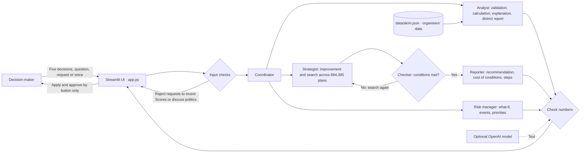

# Akim for Five Hours — a city budget and decision-making simulator

[Русский](README.md) · **English**

Team **Terricon** · HackAlem AI, 23 September 2026 · Track 03: Governance · Challenge by Astana Innovations

**Have you ever faced a choice where every proposal mattered, the budget could not cover them all, and the decision was yours?**

Imagine a meeting at city hall. Parents want a school closer to home. Residents in another district are worried
about air quality. Transport planners need funding for a new line; utility services need to replace ageing networks.
Everyone has a reason why their concern should come first. There is one budget. A decision is needed today,
and residents will live with its consequences for years.

For a manager or analyst, the difficult part is comparing those needs and explaining the choice. Who benefits?
Which district has to wait again? When will the benefits arrive? What happens if winter brings heavy smog?
Could we achieve nearly the same overall result while protecting something residents consider essential?
A spending table shows where the money goes. This discussion also needs a view of what changes in each district.

**Akim for Five Hours gives you a place to test that choice before approving it.** The exercise provides five
districts, a budget of 100 units and 14 available measures. You must choose exactly five decisions. You can start
with a familiar priority: help the weakest district, improve transport or preserve air quality. The application
checks the budget, shows district-level changes and calculates the **Astana Quality of Life Score**.
It also explains the plan’s strengths, remaining risks and a possible replacement.

For example, the organisers’ plan raises the index from **52.56 to 56.54**. Replacing one measure can bring it
to **57.21**. Then someone adds an important condition: **“Improve the plan, but do not worsen air quality in Saryarka.”**
The system searches under that condition and recommends **56.78**. The best unconstrained plan would score
**57.24**, so preserving air quality costs **0.46 points of the overall index**. There is now a concrete trade-off
to discuss: are we willing to give up some of the total gain to protect this district’s air quality?

The exercise serves managers who need to justify a choice, analysts comparing alternatives, and learners who
want to see the consequences of their own decisions. AI helps express conditions in everyday language and explains
the results. The software engine handles formulas, budget checks and search. The user applies suggestions and approves plans.

**Try it: which five decisions would you choose, and how would you explain them to residents of the district that received less?**

The prototype uses hypothetical data and effects supplied by the challenge organisers. All figures above are
results of this educational model. Real-city use would require verified local data and validated estimates of measure effects.

This is the English documentation. The application interface is in Russian; the walkthrough keeps the actual button
labels so you can find them on screen. An *akim* is the head of a local administration in Kazakhstan.

## Quick start and verification

```bash
git clone https://github.com/BAITC-Hacks/hack-5c60a040-terricon.git
cd hack-5c60a040-terricon
pip install -r requirements.txt
python scripts/check_scenario.py
python -m pytest -q
python -m streamlit run app.py
```

No OpenAI key is needed for verification. Expected results:

- `check_scenario.py` checks the main workflow and all five challenge criteria without a browser: 11 check marks
  and `Итог: 11/11 проверок`. Measured on 23 September: 2–10 seconds, depending on the machine.
- All `pytest` checks pass, with no skipped tests: the formula, seven validation rules, reference values, assistant and UI.
- The application opens at http://localhost:8501.
- The baseline Score is **52.56**. The organisers’ example (M7, M8 and M10 in Nura, M12, and M5 in Saryarka) gives **56.54**.
- A plan costing more than 100 is rejected with a reason, such as `Бюджет превышен: 101 из 100` (budget exceeded).
- The best of all **694,395** valid five-measure plans scores **57.24**.

## Three-minute demonstration: click by click

The application starts with the organisers’ example. These values are checked by `tests/test_app.py`
and `scripts/check_scenario.py`. The Russian UI uses a comma as the decimal separator.

1. **`Главное` (Main result):** the city index rises from 52.56 to 56.54, with 95 of 100 budget units spent.
   Nura’s two critical indicators—schools at 38 and clinics at 35—have improved above the threshold, as shown above the district diagram.
2. **Validation:** in `Решение 4 из 5` (Decision 4 of 5), select `Модернизация тепло- и водосетей`
   (heating and water network upgrades, cost 28). The application rejects the plan: 109 of 100 units.
   Click `Вернуть пример организаторов` (Restore the organisers’ example).
3. **Assistant request, tab 2:** the prefilled request asks to improve the plan without worsening air quality in Saryarka.
   Click `Выполнить поручение` (Run request). The search covers all 694,395 plans. The checker rejects the highest-scoring
   plan, 57.24, because it worsens Saryarka’s air quality. A constrained search recommends 56.78.
   The condition costs 0.46 Score points relative to the unconstrained optimum.
4. **`Найти улучшение` (Find an improvement):** replace clean fuel in Saryarka with light rail in Nura for
   a Score of 57.21, an increase of 0.67. Click `Применить улучшение` (Apply improvement).
5. **Stress test, tab 3:** under `Городские события` (City events), click `Проверить сценарий` (Test scenario).
   Winter smog reduces the improved plan’s Score from 57.21 to 55.60; the application suggests a replacement measure.
   Below, `Найти самый устойчивый` (Find the most robust, about 6 seconds): the highest-scoring plan (57.24) falls to
   55.80 when school enrolment rises, while the most robust plan (57.07) keeps its worst case at 55.82; robustness
   costs 0.17 points.
6. **Approve, tab 4:** only the user can click to approve the plan. The saved result shows a Score of 57.21.

## The problem and intended users

Transport, green spaces, schools, clinics, public safety and utilities compete for the same city budget.
A decision in one district affects the city-wide result, benefits take time to arrive, and the weakest district
reduces the overall Score. The simulator makes these trade-offs visible while a plan is still being discussed.

Intended users include municipal managers and analysts, local council members and public administration training
programmes. It also supports team exercises: everyone starts with the same data and budget, making plans comparable.

## Value

- Compare many alternatives quickly and see which districts benefit, which critical problems improve and which trade-offs remain.
- Ask the assistant to explain or improve a plan, including conditions such as preserving air quality in Saryarka.
  It reports the cost of those conditions in Score points.
- Account for underserved districts: 30% of the index depends on the weakest district’s score.
- Check the calculation against the formula and tests. The user makes the final approval decision.

## Future development

- Explore replacing hypothetical inputs with open data: data.egov.kz for facilities and incidents, stat.gov.kz for
  population, open.egov.kz for budgets, and Kazhydromet or IQAir for air quality.
- Add real district geography and, over time, models of climate risks and mobility.
- Explore a resident-facing mode through Smart Astana, where people can propose plans and the administration can compare preferences.
- Include employment and tax effects of measures.
- Record the source, date and version of each effect estimate in the scenario report.
- Show sensitivity to weaker or stronger effects, and identify plans that remain useful under events and changing priorities.
- Compare planned and observed district outcomes after implementation, then revise effect estimates.
- See the team’s [research note](docs/RESEARCH_2026-09-23.md) (Russian) for alternatives, priorities and evaluation ideas.

## Related tools and our approach

We reviewed three related categories:

- **Public budget simulators:** Balancing Act in the US, Citizen Budget in Canada and Delib Budget Simulator in the UK.
  Users allocate funds across categories and see the remaining budget.
- **Participatory budgeting:** OmaStadi in Helsinki, Decidim in Barcelona and CONSUL in Madrid.
  Residents propose projects and vote on them.
- **Urban dashboards and digital twins:** Dublin Dashboard, Virtual Singapore and MIT CityScope.
  These present urban conditions through data layers and indicators. Kazakhstan also has budget.egov.kz and openbudget.kz.

Our prototype combines a city-wide allocation decision with district-level consequences, plain-language explanations,
constrained search and a quantified cost of conditions. Approval remains with the user. A useful presentation pattern
from the review was to use district colours and before/after comparisons.

## Implemented features

| Feature | Behaviour |
| --- | --- |
| Validation | Exactly five decisions; budget at most 100; no duplicates; a district for district-specific measures; no more than two measures per direction; incompatible pairs rejected with a reason |
| Score calculation | Organisers’ formula: effect × (8 − lag) / 8, synergies, clipping to 0–100, district scores, population-weighted average, 70% city average + 30% weakest district − 1 for every indicator below 40 |
| Measure contributions | The drop in Score when a measure is removed |
| Explanation | Strengths, risks and consequences; a calculation-based template without a key, or model-generated text checked against calculated numbers |
| Improve a plan | The best single-measure replacement and its Score gain |
| Constrained search | Search all 694,395 valid plans with budget limits, required or excluded measures, and minimum district scores |
| Plan rank | Position among all 694,395 valid plans |
| District report | Weak indicators and the measures that improve the district most |
| Comparison and what-if | Compare two plans, or replace/add a measure and recalculate |
| Scenario report | Download a Markdown report for the decision-maker |
| Assistant request | Parse conditions, search, verify compliance and search again if necessary; show steps, a recommendation, an alternative and the cost of conditions |
| Chat | Ask why a result occurred, about a district or the remaining budget; see which tools were used |
| City events | Winter smog, heating network failure, rising school enrolment and spring flooding; show changed Scores, new critical indicators and a suggested replacement |
| Priority sensitivity | Raise a direction’s weight by 20% and compare the current plan with the best plan under the new weights |
| Most robust plan | A stress test of hypothetical scenarios: for all 694,395 plans, the worst Score across the four city events; the current plan, the highest-scoring plan and the most robust plan side by side, with the cost of robustness and a `Взять` (Take) button |
| District diagram | District colours reflect scores; a table covers ten indicators, with animated before/after changes |
| Team leaderboard | Submit a named team plan and compare Score, improvement and rank among all valid plans |
| Voice requests | Speech recognition with an OpenAI key |
| Approval | Only the user can approve a valid plan; the engine saves approval history |
| One-command verification | `python scripts/check_scenario.py` runs 11 reference checks of the main workflow |

## How it works

1. The baseline Score is 52.56. Nura’s schools (38) and clinics (35) are below 40, producing a penalty of two points.
2. The user chooses five measures and their districts. The engine validates the plan and explains any violations.
3. For a valid plan, the engine calculates the Score, district changes, measure contributions, synergies and critical indicators.
4. The assistant explains the result and suggests improvements. Replacing clean fuel in Saryarka with light rail in Nura
   raises the organisers’ example to 57.21, an increase of 0.67 and the third-best result among all 694,395 plans.
5. The user chooses whether to apply a suggestion, compare alternatives or approve a plan.

## Architecture



- `app.py` is the Streamlit interface. It displays engine results rather than calculating them. A short summary
  and four headline values lead into four tabs: decisions and results, assistant advice, stress tests, approval and ranking.
  `city_view.py` draws the district diagram with HTML and SVG, without external drawing libraries.
- `akim/` contains the engine: `rules.py` validates plans; `scoring.py` implements the formula; `optimizer.py`
  handles contributions and improvements; `search.py` indexes all 694,395 plans (about two seconds to build,
  with sub-millisecond indexed queries); `explainer.py` explains results and checks numbers; `agent.py` handles
  input checks and coordination through model tool calls or rules; `nlu.py` parses conditions; `mission.py`
  implements search, checking and retry; `tools.py` provides reports, comparisons and what-if tools; `events.py`
  handles events and priority changes; `brief.py` exports reports; `approvals.py` stores approvals; `teams.py`
  handles ranking; `voice.py` transcribes speech; and `llm.py` connects to the model.
- `scripts/check_scenario.py` checks the main workflow. `.streamlit/config.toml` defines the theme.
- `data/akim.json` reproduces the challenge’s districts, indicators, weights, 14 measures, synergies and incompatibilities.
  `data/top_plans.json` stores precomputed top plans; regenerate it with `python scripts/precompute.py` (about 30 seconds).

## What the assistant can do, and what requires the user

- **Automatically:** validate, calculate, search, explain and suggest replacements. These actions produce a draft plan.
- **User action required:** applying a replacement or approving a plan requires a button click. The assistant has no approval tool.
- **Scope:** hypothetical city scenarios, not real people, politics or the real city budget.
  Requests to invent a Score or ignore the rules are rejected.
- **Numbers and measures:** numbers and measure codes (M1–M14) in model text are checked against calculated results.
  If a check fails or the model is unavailable, the application shows a template response and remains usable.

## Technology

Python 3.11+ · Streamlit · NumPy · optional OpenAI Python SDK integration · pytest.

With a key, `gpt-5.6-sol` powers the assistant, chat and scenario explanations, with observed replies of 4–15 seconds.
`gpt-4o-mini-transcribe` handles speech recognition. The interface uses sky blue (Pantone 3125) and gold,
inspired by Kazakhstan’s national flag.

### Why the team selected `gpt-5.6-sol` on 23 September

We compared four models using a real API key and the same five requests: explain the organisers’ example,
explain the result, describe Nura, remove clean fuel in Saryarka, and improve the plan without worsening Saryarka’s air quality.
All numbers in the compared responses passed the checks. The constrained request returned the same valid plan, 56.78.

| Model | Longest response | Total for five requests | Team’s assessment of explanations |
| --- | --- | --- | --- |
| **`gpt-5.6-sol`** | 14.5 s | 45.7 s | Most detailed: causes, combinations of measures, timing and ranking |
| `gpt-5.6-luna` | 10.4 s | 32.1 s | Close to Sol, slightly shorter |
| `gpt-4.1` | 8.1 s | 20.4 s | Shorter, with some internal indicator codes in the text |
| `gpt-4.1-mini` | 8.5 s | 22.8 s | More general wording, with fewer explanations of causes |

The team chose `gpt-5.6-sol` because explanation quality mattered more than a few seconds of waiting.
These are measurements from the team’s comparison, not guaranteed response times. Set `OPENAI_MODEL` or
`OPENAI_EXPLAIN_MODEL` in `.env` to change the model. The engine remains responsible for numerical results.

## System requirements

- Windows 10/11, macOS or Linux; Python 3.11 or newer (tested on 3.13); 1 GB of free memory.
- Internet access to install dependencies and, optionally, call OpenAI.

## Installation and launch

Without Docker, first create an isolated environment with Python 3.11 or newer:

```bash
python -m venv .venv
```

Activate it in Windows PowerShell:

```powershell
.\.venv\Scripts\Activate.ps1
```

If PowerShell reports that running scripts is disabled, first run
`Set-ExecutionPolicy -Scope Process -ExecutionPolicy Bypass` (applies to this window only), or activate
the environment in cmd: `.venv\Scripts\activate.bat`.

Or in macOS/Linux:

```bash
source .venv/bin/activate
```

Install and validate the dependencies, then launch the application:

```bash
python -m pip install --upgrade pip
python -m pip install -r requirements.txt
python -m pip check
python scripts/check_scenario.py
python -m pytest -q
python -m streamlit run app.py
```

To retain a complete verification report (commit, package versions, source/data hashes, output and exit codes), run
`python scripts/check_release.py --output docs/check_local.txt`.
Success requires 11/11 scenario checks and the full pytest suite with no failures, errors or skips.
[Verification details and the additional Windows dependency snapshot (Russian)](docs/JUDGE_VERIFICATION.md).

With Docker 24 or newer:

```bash
docker build -t akim .
docker run --rm -p 8501:8501 akim
```

Open http://localhost:8501. To pass an OpenAI key to Docker:

```bash
docker run --rm -p 8501:8501 --env-file .env akim
```

All environment settings are optional. Copy `.env.example` to `.env` and add a key for model-generated text and voice.
The other features work without one.

| Variable | Purpose | Default |
| --- | --- | --- |
| `OPENAI_API_KEY` | Model-generated text and voice | Unset: template explanations |
| `OPENAI_MODEL` | Main assistant and chat model | `gpt-5.6-sol` |
| `OPENAI_EXPLAIN_MODEL` | Optional separate explanation model; `gpt-4.1` took about 8 seconds in the comparison | Same as `OPENAI_MODEL` |
| `OPENAI_REASONING_EFFORT` | Model reasoning effort | `low` |
| `OPENAI_STT_MODEL` | Speech recognition | `gpt-4o-mini-transcribe` |
| `OPENAI_TIMEOUT_SECONDS` | Model request timeout | `30` |
| `OPENAI_MAX_RETRIES` | Retries on request failure | `1` |

## Challenge criteria

All five criteria are covered by `python scripts/check_scenario.py`.

| Criterion | Implementation | Verification |
| --- | --- | --- |
| 1. Same budget and inputs | Fixed budget of 100 and data from `data/akim.json` | `tests/test_scoring.py`: baseline 52.56 |
| 2. Budget cannot be exceeded | Validation before calculation, with a reason on screen | `tests/test_rules.py`: over-budget plan |
| 3. Decisions affect indicators | Before/after values and measure contributions | `tests/test_scoring.py`: example 56.54 |
| 4. Understandable explanation and trade-offs | Strengths, risks and consequences with numeric checks | `tests/test_explainer.py` |
| 5. Changing the plan changes the Score | Recalculation after each change | `tests/test_tools.py`: comparison and what-if |

## Reference results checked by code

| Check | Result |
| --- | --- |
| Baseline | 52.56; Nura 49.18; its schools and clinics are below 40 |
| Organisers’ example | 56.54 (challenge: approximately 56.5), cost 95, rank 566 of 694,395 |
| Best single replacement for the example | M5 in Saryarka → M3 in Nura: 57.21, a gain of 0.67 |
| Valid five-measure plans | 694,395 |
| Best plan | 57.24: M2, M3 in Nura, M8 in Nura, M9 in Nura, M14; cost 98 |
| Preserve Saryarka’s air quality | Checker rejects 57.24; constrained result 56.78; condition cost 0.46 |
| Best plan costing at most 80 | 56.87, cost 72 |
| Events applied to the example (56.54) | Smog 55.30; heating failure 55.26; flood 55.97; enrolment growth 56.10 |

## Data and integrations

- The organisers supplied a synthetic dataset in `docs/task/akim_dataset.md`. It contains no personal data.
- OpenAI API is the only external service and is optional. The core workflow runs without a key.

## Limitations

- Effects follow the organisers’ simplified model: effects are additive and the implementation lag scales them linearly.
- Exhaustive search works for this catalogue of 14 measures and five districts. A larger catalogue needs another search method.

## Disclosure

- The code was written during the hackathon on 23 September 2026; no prepared code was imported into the project.
- The synthetic dataset was supplied by Astana Innovations, the challenge organiser.
- **The team created the city events** in `data/events.json`: smog, heating failure, flooding and enrolment growth.
  Their indicator changes are hypothetical stress scenarios, not organiser-supplied observations.
- The district diagram is illustrative, not a geographic map of Astana.
- The related-project review used AI-assisted searches of public sources on 23 September.
- The libraries are open source. Allowed version ranges are in `requirements.txt`; the team checked the following
  installed-package licences on 23 September:

| Library | Version in the clean installation | Licence |
| --- | --- | --- |
| Streamlit | 1.64.0 | Apache-2.0 |
| NumPy | 2.5.3 | BSD-3-Clause; some components use 0BSD, MIT or Zlib |
| OpenAI Python SDK | 3.19.0 | Apache-2.0 |
| pytest | 9.1.1 | MIT |

- OpenAI API is a paid external service governed by the provider’s terms. It is used for model text and voice,
  with a key stored in `.env`; it is not called when no key is configured.

<details>
<summary>Repository history note</summary>

Commit `0d9da2d` (14:00, “Create ger”) added an unrelated file, `ger`, through the GitHub website.
It was removed in `77279e3` (14:18). The author appears as “AI AGENT” using the email of the `avtosubaru25` account.

</details>

## How we worked with AI

Two participants built the project: **Vitaly Bosh and Dmitry Shults**, with help from Claude and Codex.
We set the goal, divided the work, discussed alternatives and made the final decisions. AI helped write code,
review it and prepare documentation. An assistant’s suggestion became part of the project after checking it.

| Participant | Responsibility |
| --- | --- |
| **Vitaly Bosh** | Problem definition, priorities, interface, clarity of results and demonstration. Worked with Claude and Codex. |
| **Dmitry Shults** | Calculation engine after the handover from Vitaly, workflow and numeric checks, team ranking, installation on a second machine and research into related tools. Worked with Codex. |

**Our working agreement.** We described the problem and expected results in [CASE.md](CASE.md), assigned work in
[TASKS.md](TASKS.md), and recorded collaboration rules in [AGENTS.md](AGENTS.md). Each task had an expected result
and a way to verify it. For example, the organisers’ plan had to score 56.54, while a plan costing more than 100
had to be rejected with a clear reason. Interface and engine work ran in parallel, using an agreed definition
of the data passed between them.

**How the assistants contributed.** Claude helped analyse the challenge, build the initial engine and tests,
review Codex’s results, assemble the main interface and prepare documentation. Vitaly’s Codex implemented and
checked interface components. Dmitry’s Codex continued engine work, added the one-command workflow check and
team ranking, improved checks of numbers in model responses, verified installation and researched related projects.
Findings became tasks, then fixes, then repeat checks.

**What changed during development.** The initial plan from our rehearsal used separate interface and server components.
At 13:35, we jointly chose a single Streamlit application that calls the calculation code directly. This made
integration and installation on another machine simpler. Claude on Vitaly’s machine prepared the first engine;
Dmitry took over its maintenance at 14:20. The interface also evolved: after comparing alternatives, the team
selected the main screen with a district diagram and a short explanation of the result.

Dmitry began reducing scenario explanation time; Claude then continued the fixes and model comparison.
Real API calls exposed failures that tests with mocked responses had not revealed. After comparing four models
on identical requests, the team selected `gpt-5.6-sol`: a more detailed explanation mattered more than the shortest wait.
The comparison is documented above.

**How we accepted changes.** We checked numbers against the organisers’ reference, ran tests, followed the workflow
through the interface, and installed from a clean clone, including Docker. Small commits kept work available in the
shared repository. Git history records changes; the division of responsibilities describes the participants’ roles,
not authorship of every line of code.

The AI in the finished application follows the same approach: code calculates, the model explains and suggests,
and the user applies and approves decisions.

## Team

**Vitaly Bosh / Виталий Бош** (`Karagandinec`) — captain, product and interface.

**Dmitry Shults / Дмитрий Шульц** (`avtosubaru25`) — technical lead, calculation engine and deployment.
