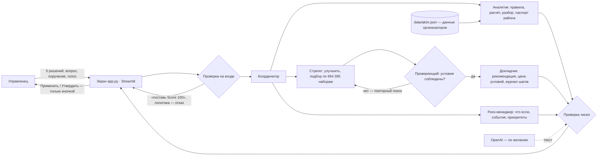

# Аким на 5 часов — ИИ-симулятор городского бюджета

Команда **Terricon** · HackAlem AI, 23.09.2026 · трек «03 · Управление» · задача Astana Innovations

Управленец распределяет один и тот же бюджет — 100 условных единиц — на ровно 5 решений из 14 мер по пяти
районам города. Программа считает **Astana Quality of Life Score** строго по формуле организаторов, а ИИ-агент
объясняет, чем за результат заплачено: сильные стороны, риски, последствия — и предлагает, как сделать лучше.
Считает только код; модель выбирает инструменты и пишет текст, но чисел не придумывает.

## Быстрая проверка за 3 минуты

```bash
git clone https://github.com/BAITC-Hacks/hack-5c60a040-terricon.git
cd hack-5c60a040-terricon
pip install -r requirements.txt
python scripts/check_scenario.py
python -m pytest -q
streamlit run app.py
```

Ключ OpenAI для проверки не нужен. Что должно получиться:

- `check_scenario.py` — главный сценарий и все пять критериев ТЗ одной командой, без браузера: 11 строк «✓»
  и «Итог: 11/11 проверок» примерно за 2 секунды;
- `pytest` — все проверки зелёные, пропущенных нет: формула, 7 правил, эталонные числа организаторов, агент, экран;
- экран открывается на http://localhost:8501;
- без решений Score города **52,56**; пример организаторов (M7, M8, M10 в Нуре, M12, M5 в Сарыарке) — **56,54**;
- набор дороже 100 не принимается — система называет причину: «Бюджет превышен: 101 из 100»;
- лучший из всех **694 395** допустимых наборов — **57,24**.

## Проблема и для кого

Городской бюджет всегда меньше списка нужного: транспорт, озеленение, школы и поликлиники, безопасность,
ЖКХ конкурируют за одни и те же деньги. Решение в одном районе меняет картину всего города, эффект мер
приходит с задержкой, а провал в отстающем районе тянет вниз общую оценку. Пользователь — городской
управленец или аналитик: ему нужно быстро сравнить сценарии и понимать цену каждого компромисса,
а не получать одну цифру без объяснений.

## Что реализовано

| Возможность | Что делает |
| --- | --- |
| Проверка правил | ровно 5 решений, бюджет ≤ 100, без повторов, район у районных мер, не больше 2 мер на направление, несовместимые пары — на каждое нарушение понятная причина |
| Расчёт Score | формула организаторов: эффект × (8 − лаг) / 8, синергии, ограничение 0–100, балл района, средний по населению, 70% город + 30% самый слабый район − 1 за каждый показатель ниже 40 |
| Вклад каждой меры | насколько Score упадёт, если убрать меру |
| Разбор компромиссов | сильные стороны, риски, последствия; без ключа — по шаблону из чисел расчёта, с ключом — текст модели, в котором каждое число сверено с расчётом |
| «Улучшить сценарий» | лучшая замена одной меры и прирост Score |
| Подбор под цель | поиск по всем 694 395 допустимым наборам с условиями: бюджет не больше, обязательно / исключить меры, ни один район не ниже заданного балла |
| Место сценария | на каком месте набор пользователя среди всех 694 395 |
| Паспорт района | слабые показатели района и меры, которые поднимут его сильнее всего |
| Сравнение и «что если» | два сценария рядом; замена или добавление меры с пересчётом |
| Паспорт сценария | отчёт для акима в Markdown — скачать одной кнопкой |
| Поручение агенту | «Улучши, но не ухудшай воздух в Сарыарке»: агент разбирает условия, ищет по всем 694 395 наборам, Проверяющий сверяет результат с условиями и при нарушении запускает повторный поиск; на экране — журнал шагов, рекомендация, альтернатива и «цена условий» — сколько баллов стоит ограничение |
| Чат с агентом | вопросы словами («почему такой результат?», «что с Нурой?», «сколько осталось?»); под ответом — какие инструменты агент использовал |
| Городские события | зимний смог, авария на теплосети, рост числа школьников, весенний паводок: Score до и после события, новые проблемные показатели и совет, какую меру заменить |
| Устойчивость к приоритетам | что будет, если вес одного направления вырастет на 20%: Score сценария и лучший набор при новых весах |
| Голосовое поручение | распознавание речи (с ключом OpenAI) |
| «Утвердить сценарий» | только человек и только допустимый набор; движок хранит историю утверждённых |
| Проверка одной командой | `python scripts/check_scenario.py` проходит главный сценарий и сверяет 11 эталонных чисел |

## Как работает

1. Экран показывает город сейчас: Score 52,56, у Нуры школы (38) и поликлиники (35) ниже 40 — штраф −2.
2. Пользователь выбирает 5 мер и районы. Движок проверяет правила и сразу называет нарушения.
3. Для допустимого набора движок считает Score, баллы районов до и после, вклад каждой меры, синергии,
   снятые и новые критические значения.
4. Агент объясняет результат и предлагает улучшение. Например, для примера организаторов: заменить
   «Чистое топливо» в Сарыарке на ЛРТ в Нуре — 57,21 (+0,67), это третий лучший из 694 395 наборов.
5. Пользователь сам решает: «Применить» предложение, сравнить варианты, «Утвердить сценарий».

## Архитектура



- `app.py` — экран на Streamlit: ничего не считает, показывает ответы движка.
- `akim/` — движок: `rules.py` (правила), `scoring.py` (формула), `optimizer.py` (вклад мер, «Улучшить»),
  `search.py` (индекс всех 694 395 наборов: строится за ~2 с, запрос — доли миллисекунды), `explainer.py`
  (разбор и проверка чисел), `agent.py` (проверка на входе и координатор: с ключом модель выбирает инструменты,
  без ключа — правила), `nlu.py` (поручение текстом → условия), `mission.py` (поиск → Проверяющий → повторный
  поиск → цена условий), `tools.py` (паспорт района, сравнение, «что если»), `events.py` (городские события,
  устойчивость к приоритетам), `brief.py` (паспорт сценария), `approvals.py` (утверждённые сценарии),
  `teams.py` (рейтинг команд), `voice.py` (голос), `llm.py` (подключение модели).
- `scripts/check_scenario.py` — главный сценарий одной командой; `.streamlit/config.toml` — оформление.
- `data/akim.json` — районы, показатели, веса, 14 мер, синергии, несовместимости — перенесены из ТЗ один в один;
  `data/top_plans.json` — заранее посчитанные лучшие наборы (`python scripts/precompute.py`, ~30 с).

## Что агент делает сам и что только после человека

- **Сам:** проверяет правила, считает Score, ищет лучшие наборы, объясняет компромиссы, предлагает замену.
  Всё это обратимо — черновик сценария.
- **Только человек:** применить предложенную замену и утвердить сценарий — кнопками на экране.
  У агента нет действия «утвердить».
- **О чём не судит:** реальные люди, политика, настоящий бюджет города — это симулятор на условных данных.
  Просьбы «поставь Score 100», «забудь правила» — отказ.
- **Числа только из расчёта:** каждое число в тексте модели сверяется с результатом расчёта; если хоть одно не
  совпало или модель недоступна, показывается разбор по шаблону — экран не ломается.

## Технологии

Python 3.11+ · Streamlit · NumPy · OpenAI Python SDK (по желанию) · pytest.
Модели OpenAI (только с ключом): `gpt-5.6-sol` — текст разбора; `gpt-4o-mini-transcribe` — распознавание речи.
Оформление — цвета государственного флага Казахстана: небесно-голубой (Pantone 3125) и золотой.

## Системные требования

- Windows 10/11, macOS или Linux; Python 3.11 или новее (проверено на 3.13); 1 ГБ свободной памяти.
- Интернет нужен только для установки зависимостей и, по желанию, для модели OpenAI.

## Установка и запуск

Без Docker:

```bash
pip install -r requirements.txt
streamlit run app.py
```

С Docker (Docker 24+):

```bash
docker build -t akim .
docker run --rm -p 8501:8501 akim
```

Экран — http://localhost:8501. С ключом OpenAI: `docker run --rm -p 8501:8501 --env-file .env akim`.

Параметры окружения — необязательные. Скопируйте `.env.example` в `.env` и укажите ключ, если хотите текст
модели и голос; без ключа работает всё остальное:

| Переменная | Зачем | По умолчанию |
| --- | --- | --- |
| `OPENAI_API_KEY` | текст разбора моделью и голос | не задан — работает шаблон |
| `OPENAI_MODEL` | модель для текста | `gpt-5.6-sol` |
| `OPENAI_REASONING_EFFORT` | глубина рассуждения модели | `low` |
| `OPENAI_STT_MODEL` | модель распознавания речи | `gpt-4o-mini-transcribe` |
| `OPENAI_TIMEOUT_SECONDS` | сколько секунд ждать ответа модели | `30` |
| `OPENAI_MAX_RETRIES` | сколько раз повторить вызов при сбое | `1` |

## Соответствие критериям задачи

Все пять критериев проверяются одной командой — `python scripts/check_scenario.py`.

| Критерий проверки из ТЗ | Что сделали | Где проверить |
| --- | --- | --- |
| 1. Одинаковый бюджет и исходные данные | бюджет 100 и данные из `data/akim.json`, пользователь их не меняет | `tests/test_scoring.py` — база 52,56 |
| 2. Нельзя превысить бюджет | проверка правил до расчёта, причина на экране | `tests/test_rules.py` — набор на 101 |
| 3. Решения влияют на показатели | баллы районов и показатели до/после, вклад мер | `tests/test_scoring.py` — пример 56,54 |
| 4. Понятное объяснение и компромиссы | сильные стороны, риски, последствия со сверкой чисел | `tests/test_explainer.py` |
| 5. Другой набор — другой Score | пересчёт при каждом изменении | `tests/test_tools.py` — сравнение, «что если» |

## Проверено кодом

| Что | Значение |
| --- | --- |
| Score без решений | 52,56 (Нура 49,18; ниже 40 — школы и поликлиники Нуры) |
| Пример организаторов | 56,54 (в ТЗ «≈ 56,5»), бюджет 95, 566-е место из 694 395 |
| Лучшая замена одной меры для примера | M5 в Сарыарке → M3 в Нуре: 57,21 (+0,67) |
| Допустимых наборов из 5 мер | 694 395 |
| Лучший набор | 57,24: M2, M3 Нура, M8 Нура, M9 Нура, M14 — стоимость 98 |
| Поручение «не ухудшай воздух в Сарыарке» для примера | Проверяющий отклоняет 57,24, повторный поиск — 56,78; цена условия 0,46 балла |
| Лучший набор не дороже 80 | 56,87 за 72 |
| Городские события для примера (56,54) | смог 55,30 · авария на теплосети 55,26 · паводок 55,97 · рост числа школьников 56,10 |

## Данные и интеграции

- Данные — синтетический датасет организаторов (`docs/task/akim_dataset.md`), персональных данных нет.
- Внешний сервис — только OpenAI API, по желанию. Без ключа приложение работает полностью.

## Ограничения

- Модель эффектов мер — упрощённая модель организаторов: эффекты складываются, лаг масштабирует эффект линейно.
- Полный перебор подходит для каталога такого размера (14 мер, 5 районов); для больших каталогов нужен
  другой способ поиска.

## Раскрытие

- Весь код написан 23.09.2026 во время хакатона, заготовки не переносились.
- Данные — от организаторов (Astana Innovations), синтетические.
- Библиотеки: Streamlit, NumPy, OpenAI Python SDK, pytest — открытые, по лицензиям авторов.

## Как мы работали с ИИ

- **Claude (Claude Code, Anthropic)** — на ноутбуке Виталия: разбор кейса (`CASE.md`), задания (`TASKS.md`),
  движок `akim/` и тесты до 14:20, проверка каждого задания Codex, оформление, README.
- **Codex (OpenAI) у Виталия** — экран `app.py` и его тесты по заданиям В-1…В-7 из `TASKS.md`; коммитит Claude
  после проверки.
- **Codex (OpenAI) у Дмитрия** — с 14:20 движок: проверка сценария одной командой (Д-8), рейтинг команд (Д-10).

## Команда

Виталий Бош (`Karagandinec`) — капитан, продукт и экран · Дмитрий Шульц (`avtosubaru25`) — техлид, движок и запуск.
