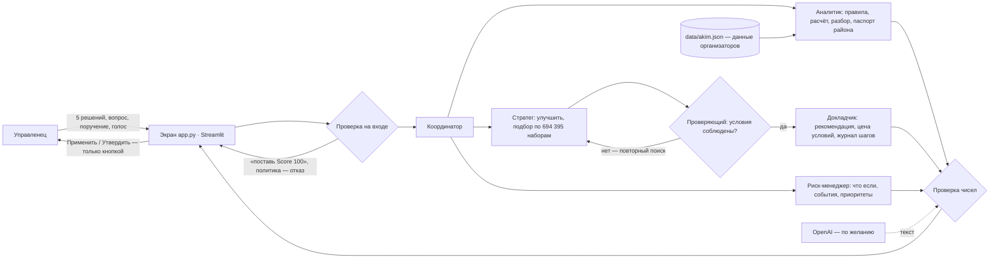

# Аким на 5 часов — ИИ-симулятор городского бюджета

Команда **Terricon** · HackAlem AI, 23.09.2026 · трек «03 · Управление» · задача Astana Innovations

Управленец распределяет один и тот же бюджет — 100 условных единиц — на ровно 5 решений из 14 мер по пяти
районам города. Программа считает **Astana Quality of Life Score** строго по формуле организаторов, а ИИ-агент
объясняет, чем за результат заплачено: сильные стороны, риски, последствия — и предлагает, как сделать лучше.
Считает только код; модель выбирает инструменты и пишет текст, но чисел не придумывает.

## Быстрая проверка за 3 минуты

```bash
git clone https://github.com/BAITC-Hacks/hack-5c60a040-terricon.git
cd hack-5c60a040-terricon
pip install -r requirements.txt
python scripts/check_scenario.py
python -m pytest -q
python -m streamlit run app.py
```

Ключ OpenAI для проверки не нужен. Что должно получиться:

- `check_scenario.py` — главный сценарий и все пять критериев ТЗ одной командой, без браузера: 11 строк «✓»
  и «Итог: 11/11 проверок» примерно за 2 секунды;
- `pytest` — все проверки зелёные, пропущенных нет: формула, 7 правил, эталонные числа организаторов, агент, экран;
- экран открывается на http://localhost:8501;
- без решений Score города **52,56**; пример организаторов (M7, M8, M10 в Нуре, M12, M5 в Сарыарке) — **56,54**;
- набор дороже 100 не принимается — система называет причину: «Бюджет превышен: 101 из 100»;
- лучший из всех **694 395** допустимых наборов — **57,24**.

## Проблема и для кого

Денег в городском бюджете всегда меньше, чем нужд: транспорт, зелень, школы и поликлиники, безопасность, ЖКХ
спорят за одни и те же деньги. Решение в одном районе меняет картину всего города, эффект приходит через месяцы,
а отстающий район тянет вниз общую оценку. Такие решения часто принимают по таблицам и интуиции — последствия
видны только через год. Кто пользуется: руководители и аналитики акимата, депутаты маслихата, программы обучения
управленцев; команды на обучающей игре — бюджет и данные у всех одинаковые, поэтому видно, чьё решение лучше.

## Ценность

- За минуты — десятки вариантов вместо недель расчётов: сразу видно, какой район поднимется, какие острые
  проблемы уйдут и чем за это заплачено.
- ИИ-агент объясняет компромиссы простыми словами и сам ищет лучший вариант среди всех 694 395 — в том числе
  под условия («не ухудшай воздух в Сарыарке») — и честно называет цену условия в баллах.
- Оценка справедливая: 30% индекса — самый слабый район, поэтому нельзя «вылизать» центр и бросить окраину.
- Числа считает программа, а не ИИ, — им можно доверять; утверждает сценарий только человек.

## Потенциал развития

- Заменить условные данные открытыми: data.egov.kz (школы, поликлиники, ДТП, камеры «Сергек»), stat.gov.kz
  (население районов), open.egov.kz (бюджет), Казгидромет и IQAir (воздух).
- Настоящая карта районов и цифровой двойник города; учёт климатических рисков и перемещений жителей.
- Режим для жителей в Smart Astana: каждый собирает свой сценарий, акимат видит, чего хотят люди в каждом районе.
- Учёт налогов и рабочих мест, которые дают меры.

## Аналоги и чем мы отличаемся

Похожие инструменты есть в трёх направлениях:

- **симуляторы городского бюджета для жителей** — Balancing Act (США), Citizen Budget (Канада),
  Delib Budget Simulator (Великобритания): бюджет раздают по статьям и сразу видят остаток;
- **партисипаторное бюджетирование** — OmaStadi (Хельсинки), Decidim (Барселона), CONSUL (Мадрид): жители
  предлагают проекты и голосуют за них по районам;
- **городские панели и цифровые двойники** — Dublin Dashboard, Virtual Singapore, MIT CityScope: состояние города
  слоями данных и шкалами. В Казахстане — открытые бюджеты budget.egov.kz и openbudget.kz.

Чем отличаемся: один управленец решает за весь город, а программа считает последствия по каждому району;
ИИ-агент объясняет риски простыми словами, выполняет поручения («улучши, но не ухудшай воздух в Сарыарке»)
и называет цену условий; утверждает только человек. Среди аналогов, которые мы посмотрели, такого сочетания
нет. От них взят главный приём наглядности — цвет района и «было → стало» вместо таблиц чисел.

## Что реализовано

| Возможность | Что делает |
| --- | --- |
| Проверка правил | ровно 5 решений, бюджет ≤ 100, без повторов, район у районных мер, не больше 2 мер на направление, несовместимые пары — на каждое нарушение понятная причина |
| Расчёт Score | формула организаторов: эффект × (8 − лаг) / 8, синергии, ограничение 0–100, балл района, средний по населению, 70% город + 30% самый слабый район − 1 за каждый показатель ниже 40 |
| Вклад каждой меры | насколько Score упадёт, если убрать меру |
| Разбор компромиссов | сильные стороны, риски, последствия; без ключа — по шаблону из чисел расчёта, с ключом — текст модели, в котором каждое число сверено с расчётом |
| «Улучшить сценарий» | лучшая замена одной меры и прирост Score |
| Подбор под цель | поиск по всем 694 395 допустимым наборам с условиями: бюджет не больше, обязательно / исключить меры, ни один район не ниже заданного балла |
| Место сценария | на каком месте набор пользователя среди всех 694 395 |
| Паспорт района | слабые показатели района и меры, которые поднимут его сильнее всего |
| Сравнение и «что если» | два сценария рядом; замена или добавление меры с пересчётом |
| Паспорт сценария | отчёт для акима в Markdown — скачать одной кнопкой |
| Поручение агенту | «Улучши, но не ухудшай воздух в Сарыарке»: агент разбирает условия, ищет по всем 694 395 наборам, Проверяющий сверяет результат с условиями и при нарушении запускает повторный поиск; на экране — журнал шагов, рекомендация, альтернатива и «цена условий» — сколько баллов стоит ограничение |
| Чат с агентом | вопросы словами («почему такой результат?», «что с Нурой?», «сколько осталось?»); под ответом — какие инструменты агент использовал |
| Городские события | зимний смог, авария на теплосети, рост числа школьников, весенний паводок: Score до и после события, новые проблемные показатели и совет, какую меру заменить |
| Устойчивость к приоритетам | что будет, если вес одного направления вырастет на 20%: Score сценария и лучший набор при новых весах |
| Живая схема районов | цвет района — его балл, таблица «район × 10 показателей» со значками; при каждом изменении решений схема перетекает «было → стало» |
| Рейтинг команд | команда отправляет свой сценарий под своим названием; рейтинг показывает место, индекс, прирост и место среди всех 694 395 вариантов |
| Голосовое поручение | распознавание речи (с ключом OpenAI) |
| «Утвердить сценарий» | только человек и только допустимый набор; движок хранит историю утверждённых |
| Проверка одной командой | `python scripts/check_scenario.py` проходит главный сценарий и сверяет 11 эталонных чисел |

## Как работает

1. Экран показывает город сейчас: Score 52,56, у Нуры школы (38) и поликлиники (35) ниже 40 — штраф −2.
2. Пользователь выбирает 5 мер и районы. Движок проверяет правила и сразу называет нарушения.
3. Для допустимого набора движок считает Score, баллы районов до и после, вклад каждой меры, синергии,
   снятые и новые критические значения.
4. Агент объясняет результат и предлагает улучшение. Например, для примера организаторов: заменить
   «Чистое топливо» в Сарыарке на ЛРТ в Нуре — 57,21 (+0,67), это третий лучший из 694 395 наборов.
5. Пользователь сам решает: «Применить» предложение, сравнить варианты, «Утвердить сценарий».

## Архитектура



- `app.py` — экран на Streamlit: ничего не считает, показывает ответы движка. Сверху — «Главное» одной фразой
  и четыре крупные цифры, ниже четыре шага вкладками: решения и результат · совет ИИ-агента · проверка на
  прочность · утверждение и рейтинг. `city_view.py` — живая схема районов (HTML и SVG, без внешних библиотек).
- `akim/` — движок: `rules.py` (правила), `scoring.py` (формула), `optimizer.py` (вклад мер, «Улучшить»),
  `search.py` (индекс всех 694 395 наборов: строится за ~2 с, запрос — доли миллисекунды), `explainer.py`
  (разбор и проверка чисел), `agent.py` (проверка на входе и координатор: с ключом модель выбирает инструменты,
  без ключа — правила), `nlu.py` (поручение текстом → условия), `mission.py` (поиск → Проверяющий → повторный
  поиск → цена условий), `tools.py` (паспорт района, сравнение, «что если»), `events.py` (городские события,
  устойчивость к приоритетам), `brief.py` (паспорт сценария), `approvals.py` (утверждённые сценарии),
  `teams.py` (рейтинг команд), `voice.py` (голос), `llm.py` (подключение модели).
- `scripts/check_scenario.py` — главный сценарий одной командой; `.streamlit/config.toml` — оформление.
- `data/akim.json` — районы, показатели, веса, 14 мер, синергии, несовместимости — перенесены из ТЗ один в один;
  `data/top_plans.json` — заранее посчитанные лучшие наборы (`python scripts/precompute.py`, ~30 с).

## Что агент делает сам и что только после человека

- **Сам:** проверяет правила, считает Score, ищет лучшие наборы, объясняет компромиссы, предлагает замену.
  Всё это обратимо — черновик сценария.
- **Только человек:** применить предложенную замену и утвердить сценарий — кнопками на экране.
  У агента нет действия «утвердить».
- **О чём не судит:** реальные люди, политика, настоящий бюджет города — это симулятор на условных данных.
  Просьбы «поставь Score 100», «забудь правила» — отказ.
- **Числа только из расчёта:** каждое число в тексте модели сверяется с результатом расчёта; если хоть одно не
  совпало или модель недоступна, показывается разбор по шаблону — экран не ломается.

## Технологии

Python 3.11+ · Streamlit · NumPy · OpenAI Python SDK (по желанию) · pytest.
Модели OpenAI (только с ключом): `gpt-5.6-sol` — агент, чат и разбор сценария (ответ 4–15 секунд);
`gpt-4o-mini-transcribe` — распознавание речи.
Оформление — цвета государственного флага Казахстана: небесно-голубой (Pantone 3125) и золотой.

### Почему `gpt-5.6-sol` — решение команды 23.09

Сравнили модели живым ключом на одних и тех же пяти запросах: разбор сценария организаторов, «Почему такой
результат?», «Что с Нурой?», «Что если убрать чистое топливо в Сарыарке?», поручение «Улучши, но не ухудшай
качество воздуха в Сарыарке». У всех четырёх моделей в таблице каждое число прошло сверку с расчётом, а поручение
дало один и тот же проверенный набор — 56,78 при соблюдённом условии.

| Модель | Самый долгий ответ | Все 5 запросов | Как объясняет |
| --- | --- | --- | --- |
| **`gpt-5.6-sol`** | 14,5 с | 45,7 с | глубже всех: причины результата, связки мер, сроки эффекта, место среди всех вариантов |
| `gpt-5.6-luna` | 10,4 с | 32,1 с | близко к Sol, чуть короче |
| `gpt-4.1` | 8,1 с | 20,4 с | короче, в тексте попадаются служебные коды показателей |
| `gpt-4.1-mini` | 8,5 с | 22,8 с | общие формулировки без причин |

Выбрали `gpt-5.6-sol`: для решения акима рассудительность и корректность объяснения важнее нескольких секунд.
Модель меняется одной строкой в `.env` (`OPENAI_MODEL`, `OPENAI_EXPLAIN_MODEL`); считает всегда код, поэтому смена
модели меняет только текст, но не числа.

## Системные требования

- Windows 10/11, macOS или Linux; Python 3.11 или новее (проверено на 3.13); 1 ГБ свободной памяти.
- Интернет нужен только для установки зависимостей и, по желанию, для модели OpenAI.

## Установка и запуск

Без Docker:

```bash
pip install -r requirements.txt
python -m streamlit run app.py
```

С Docker (Docker 24+):

```bash
docker build -t akim .
docker run --rm -p 8501:8501 akim
```

Экран — http://localhost:8501. С ключом OpenAI: `docker run --rm -p 8501:8501 --env-file .env akim`.

Параметры окружения — необязательные. Скопируйте `.env.example` в `.env` и укажите ключ, если хотите текст
модели и голос; без ключа работает всё остальное:

| Переменная | Зачем | По умолчанию |
| --- | --- | --- |
| `OPENAI_API_KEY` | текст разбора моделью и голос | не задан — работает шаблон |
| `OPENAI_MODEL` | основная модель агента и чата | `gpt-5.6-sol` |
| `OPENAI_EXPLAIN_MODEL` | другая модель для разбора сценария, если нужна быстрее (`gpt-4.1` — около 8 с) | как `OPENAI_MODEL` |
| `OPENAI_REASONING_EFFORT` | глубина рассуждения модели | `low` |
| `OPENAI_STT_MODEL` | модель распознавания речи | `gpt-4o-mini-transcribe` |
| `OPENAI_TIMEOUT_SECONDS` | сколько секунд ждать ответа модели | `30` |
| `OPENAI_MAX_RETRIES` | сколько раз повторить вызов при сбое | `1` |

## Соответствие критериям задачи

Все пять критериев проверяются одной командой — `python scripts/check_scenario.py`.

| Критерий проверки из ТЗ | Что сделали | Где проверить |
| --- | --- | --- |
| 1. Одинаковый бюджет и исходные данные | бюджет 100 и данные из `data/akim.json`, пользователь их не меняет | `tests/test_scoring.py` — база 52,56 |
| 2. Нельзя превысить бюджет | проверка правил до расчёта, причина на экране | `tests/test_rules.py` — набор на 101 |
| 3. Решения влияют на показатели | баллы районов и показатели до/после, вклад мер | `tests/test_scoring.py` — пример 56,54 |
| 4. Понятное объяснение и компромиссы | сильные стороны, риски, последствия со сверкой чисел | `tests/test_explainer.py` |
| 5. Другой набор — другой Score | пересчёт при каждом изменении | `tests/test_tools.py` — сравнение, «что если» |

## Проверено кодом

| Что | Значение |
| --- | --- |
| Score без решений | 52,56 (Нура 49,18; ниже 40 — школы и поликлиники Нуры) |
| Пример организаторов | 56,54 (в ТЗ «≈ 56,5»), бюджет 95, 566-е место из 694 395 |
| Лучшая замена одной меры для примера | M5 в Сарыарке → M3 в Нуре: 57,21 (+0,67) |
| Допустимых наборов из 5 мер | 694 395 |
| Лучший набор | 57,24: M2, M3 Нура, M8 Нура, M9 Нура, M14 — стоимость 98 |
| Поручение «не ухудшай воздух в Сарыарке» для примера | Проверяющий отклоняет 57,24, повторный поиск — 56,78; цена условия 0,46 балла |
| Лучший набор не дороже 80 | 56,87 за 72 |
| Городские события для примера (56,54) | смог 55,30 · авария на теплосети 55,26 · паводок 55,97 · рост числа школьников 56,10 |

## Данные и интеграции

- Данные — синтетический датасет организаторов (`docs/task/akim_dataset.md`), персональных данных нет.
- Внешний сервис — только OpenAI API, по желанию. Без ключа приложение работает полностью.

## Ограничения

- Модель эффектов мер — упрощённая модель организаторов: эффекты складываются, лаг масштабирует эффект линейно.
- Полный перебор подходит для каталога такого размера (14 мер, 5 районов); для больших каталогов нужен
  другой способ поиска.

## Раскрытие

- Весь код написан 23.09.2026 во время хакатона, заготовки не переносились.
- Данные — от организаторов (Astana Innovations), синтетические.
- **Городские события придуманы командой** (`data/events.json`): смог, авария на теплосети, паводок, рост числа
  школьников и их сдвиги показателей — условные сценарии для проверки на прочность, не данные организаторов.
- Схема районов на экране — условная, не географическая карта Астаны.
- Обзор аналогов — поиск ИИ-помощника по открытым источникам 23.09.
- Библиотеки: Streamlit, NumPy, OpenAI Python SDK, pytest — открытые, по лицензиям авторов.

## Как мы работали с ИИ

- **Claude (Claude Code, Anthropic)** — на ноутбуке Виталия: разбор кейса (`CASE.md`), задания (`TASKS.md`),
  движок `akim/` и тесты до 14:20, проверка каждого задания Codex (находки уходили обратно в задания), живая
  проверка модели с ключом, основной экран (`app.py`, `city_view.py`), оформление, README.
- **Codex (OpenAI) у Виталия** — сессия `01a0cd6c-0bdd-78b1-a0f5-b13f7aea16ce` с 13:40 (журнал в
  `~/.codex/sessions/2026/09/23/`): экран по заданиям В-1…В-5 и В-7 из `TASKS.md` — вариант В-7 сохранён в
  истории (коммит `af03cb5`), основным стал экран Claude. Коммитит Claude после проверки.
- **Codex (OpenAI) у Дмитрия** — с 14:20 движок: проверка сценария одной командой (Д-8), рейтинг команд (Д-10),
  живой режим модели и проверка чисел (Д-11), отдельная быстрая модель для разбора сценария (Д-12).
- Кто что сделал — по автору коммита: `git log --format='%h %ad %an %s' --date=format:'%H:%M'`.

## Команда

Виталий Бош (`Karagandinec`) — капитан, продукт и экран · Дмитрий Шульц (`avtosubaru25`) — техлид, движок и запуск.
